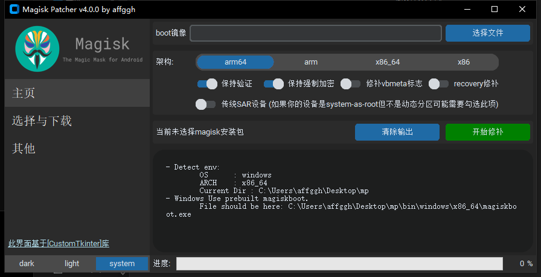
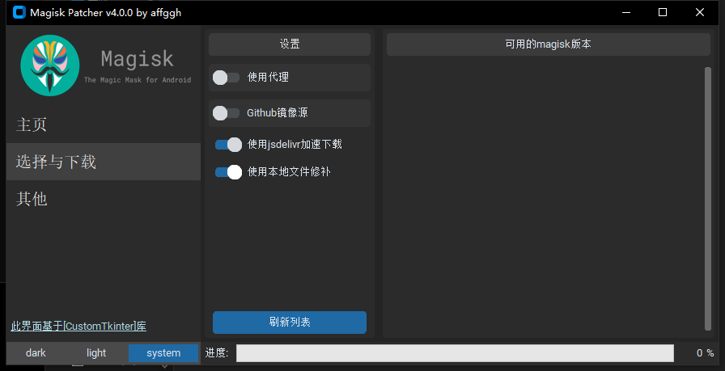

# Magisk Patcher v4
`A tool to patch boot image with magisk on desktop`

# Screenshots

# Usage
## Setup python env
`pip install -r requirements`

## Run
`python magiskpatcher.py`

# Theme
`A very pretty tkinter`
***[CustomTkinter](https://customtkinter.tomschimansky.com)***

# Donate me

