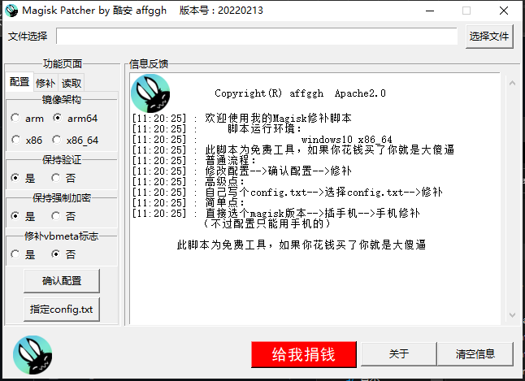

# Magisk_patcher
*Patch boot with magisk on windows/linux    
Using python tkinter    
Windows support:    
    Windows 10, 11 amd64 only      
    if you are using 32bit windows, please install python and modules    
    and run script instead exe file....       
Linux support:    
    Test on Ubuntu 20.04 LTS    
    support arch :    
        arm    
        aarch64    
        x86    
        x86_64    
# GUI screen shortcut

# GUI THEME
GUI ttk THEME from [ttkbootstrap](https://ttkbootstrap.readthedocs.io/)
# Requirements
## Windows:    
    There is nothing need on windows    
    python script support python3.8+    
    if windows 32bit use python run script instead run exe
## Linux:    
Debian/Ubuntu:
````
    sudo apt install python3 python3-tk    
    pip install mttkinter    
    sudo apt install adb # if you need read config from device       
````    
Archlinux:
````
    yay -S python adb
    pip install mttkinter
````   
### Run with python
``` bash
python3 -m pip install ttkbootstrap pillow
python3 ./Magiskpatcher.py
# If you are using ubuntu
sudo apt install python3-pil python3-pil.imagetk
# If you are using arch linux
sudo pacman -S python-pillow
```    
NOTiCE : Batch script now has been removed, if you want using it     
         please download release version 1.0    

# Thanks
感谢：    
    [thka2016](https://github.com/thka2016) 帮我写了个很好用的功能    
	[Magisk](https://github.com/topjohnwu/Magisk) 源码来自magisk    

# Donate me


